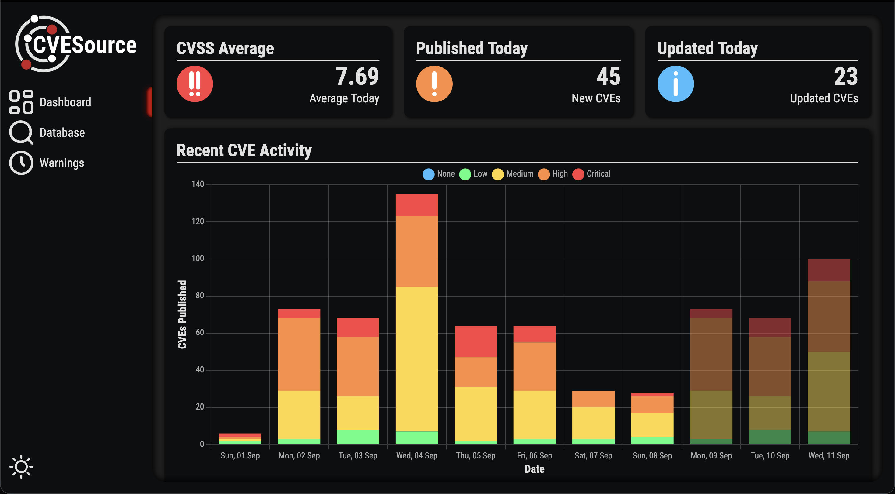
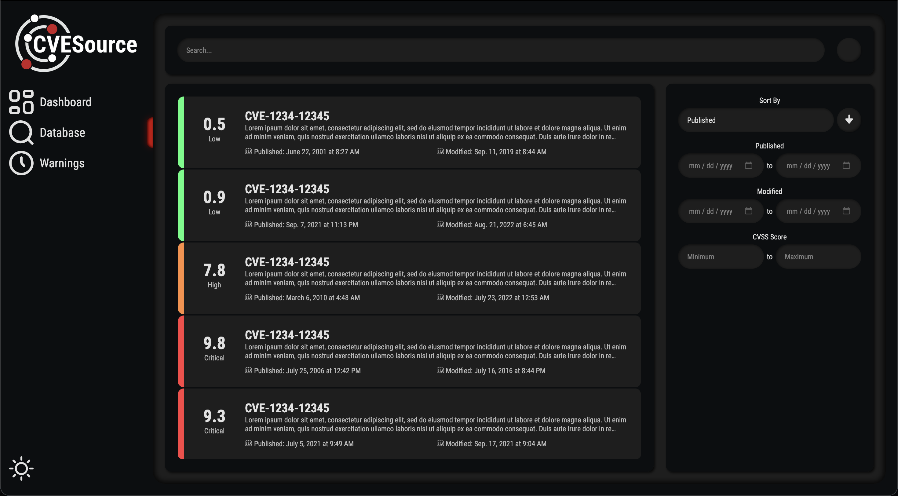

# CVE Source - Web

This is a mostly abandoned project that I was working on to create an alternative to the outdated CVE database website that are out there currently. I also wanted to implement some simple machine learning to estimate the expected number of vulnerabilities in the coming days, weeks, months, etc. based on historical trends

Priorities just got conflicting, only uploading it to my GitHub so I don't lose it if I decide to revisit it one day

## Setup

```shell
pip3 install -r requirements.txt

python manage.py runserver

# Navigate to http://localhost:8000
# Click on "Launch App" in the top right

```

## Screenshots

### Dashboard


### Database

